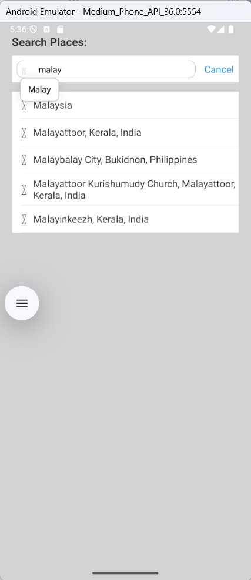
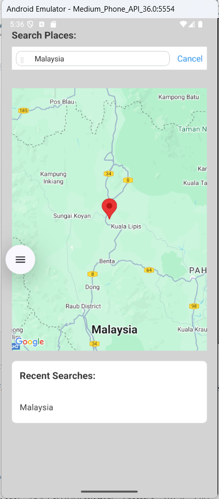
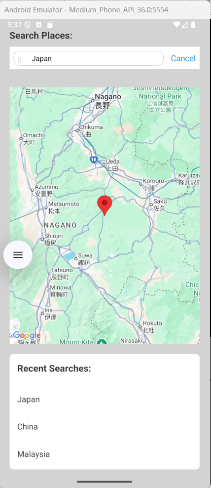

# Google Places Autocomplete - React Native App

This React Native application demonstrates how to use the **Google Places API (v1)** to implement a simple single-page app for place autocomplete and mapping, using **Redux**, **Redux-Observable**, and **Ant Design** components.

---

## ✅ Features

- Google Places Autocomplete using the new `places.googleapis.com/v1/places:autocomplete` API
- Fetches full place details (lat/lng) on selection using `places.googleapis.com/v1/places/{place_id}`
- Displays selected location on a map with `react-native-maps`
- Autocomplete search results are managed via Redux and Redux-Observable
- Recent search history is stored in Redux and displayed below the map
- Uses mock data as a fallback if API fails
- Modern, scalable folder structure using best practices
- Ant Design components for clean and simple UI

---

## 📦 Libraries Used

- `react-native-maps` - display the map and markers
- `redux`, `react-redux` - state management
- `redux-observable`, `rxjs` - handle async side effects
- `@ant-design/react-native` - UI components
- `axios` - API calls

---

## 🛠 Fallback on API Failure

If the Google API fails (e.g., rate limit, network error, invalid key), the app automatically switches to **mock predictions** to continue providing basic UX without crashing.

This fallback is implemented in the service:

```js
if (response.data.status === 'REQUEST_DENIED') {
    console.warn('Google Places API request denied. Using mock data.');
    return { predictions: PREDICTIONS_DATA };
}
```

You can find `mockData` defined in the service file.

---

## 🔐 API Key Security

- The app uses API keys restricted by **Android package name** and **SHA-1 fingerprint**
- The key is injected in `AndroidManifest.xml` for `react-native-maps`:
  ```xml
  <meta-data
    android:name="com.google.android.geo.API_KEY"
    android:value="YOUR_GOOGLE_MAPS_API_KEY" />
  ```

---

## 📁 Folder Structure

```
src/
├── api/                # Google Places API wrapper
├── components/         # UI components
├── redux/              # Actions, reducers, epics
│   ├── actions/
│   ├── reducers/
│   ├── epics/
│   └── store.js
├── screens/            # HomeScreen
├── services/           # placesService.js
├── hocs/               # High-order components
├── utils/             

```
---

## 🖼️ Screenshots

### 🔍 Search with Autocomplete


### 🗺️ Place Shown on Map


### 🕓 Search History


> Place your screenshot images in `assets/screenshots/` folder.

---
---

## 🚀 How to Run

```bash
npm install

## Step 1: Start Metro

First, you will need to run **Metro**, the JavaScript build tool for React Native.

To start the Metro dev server, run the following command from the root of your React Native project:

```sh
# Using npm
npm start

# OR using Yarn
yarn start
```
## Step 2: Build and run your app

With Metro running, open a new terminal window/pane from the root of your React Native project, and use one of the following commands to build and run your Android or iOS app:

### Android

```sh
# Using npm
npm run android

# OR using Yarn
yarn android
```
### iOS

For iOS, remember to install CocoaPods dependencies (this only needs to be run on first clone or after updating native deps).

The first time you create a new project, run the Ruby bundler to install CocoaPods itself:

```sh
bundle install
```

Then, and every time you update your native dependencies, run:

```sh
bundle exec pod install
```

For more information, please visit [CocoaPods Getting Started guide](https://guides.cocoapods.org/using/getting-started.html).

```sh
# Using npm
npm run ios

# OR using Yarn
yarn ios
```

If everything is set up correctly, you should see your new app running in the Android Emulator, iOS Simulator, or your connected device.

This is one way to run your app — you can also build it directly from Android Studio or Xcode.

---

## 👨‍💻 Author

Built with ❤️ using React Native, RxJS, and Google Maps API
